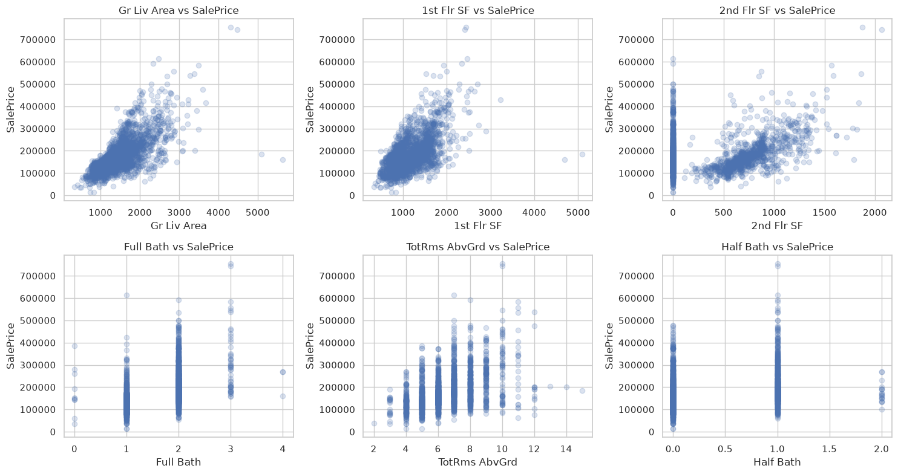
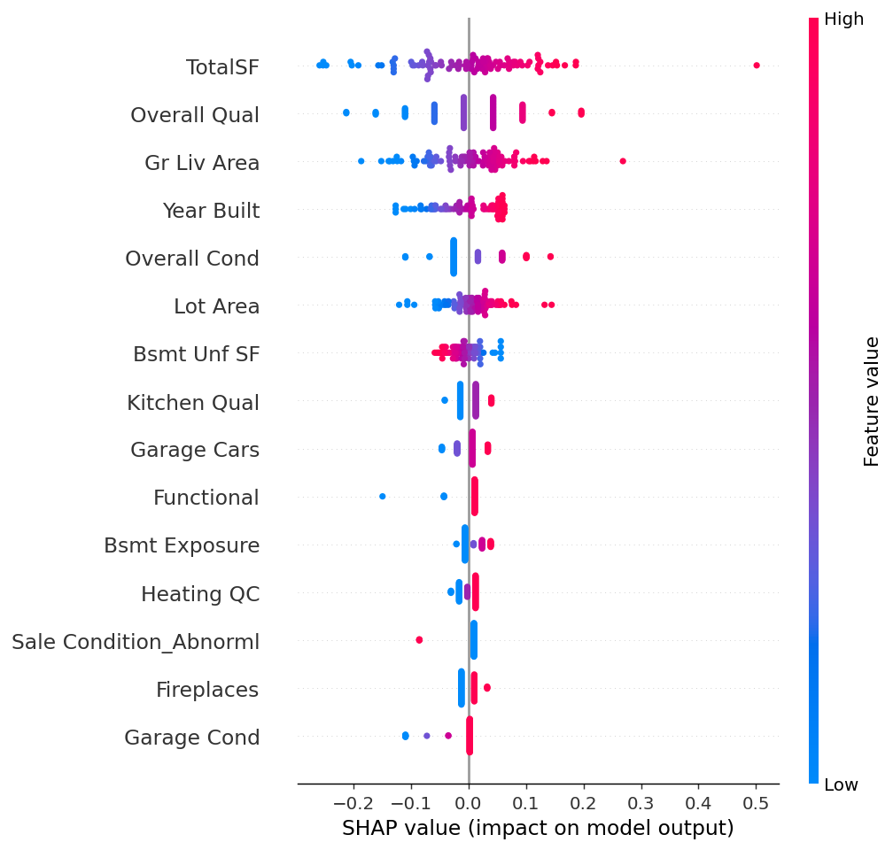
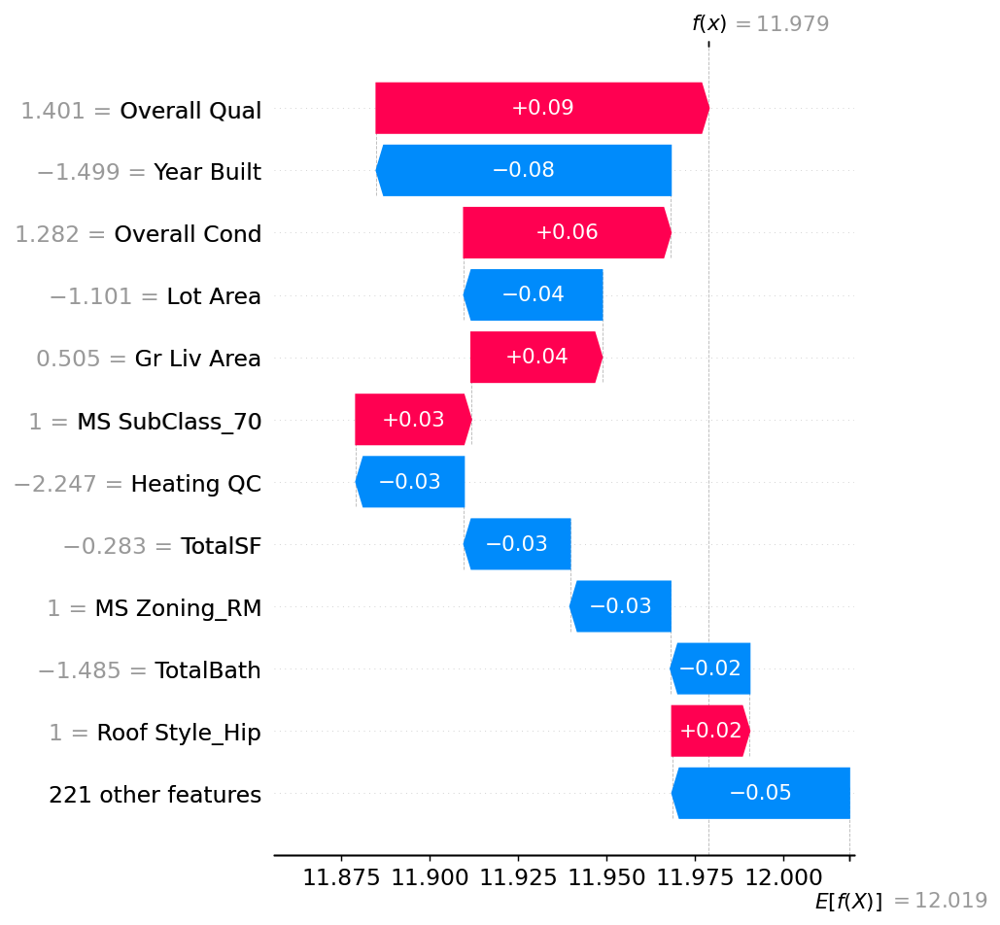

# Ames Housing — SalePrice Prediction

## Overview

This project predicts the **sale price of residential properties in Ames, Iowa** using the Ames Housing dataset.

The project covers a complete machine learning workflow:

- Exploratory data analysis
- Feature engineering
- Data preprocessing
- Model comparison
- Cross-validation
- Hyperparameter tuning
- Final held-out test evaluation
- Model serialization

The final model is a **Tuned Lasso Regression**.

## Dataset

The Ames Housing dataset contains **2,930 property sales from 2006–2010**, with roughly 80 features describing characteristics such as:

- Overall quality
- Living area
- Lot size
- Neighborhood
- Bedrooms and bathrooms
- Garage and basement information
- Year built
- Sale conditions

The target variable is `SalePrice`.

The notebook expects the dataset at:

```
data/AmesHousing.csv
```

The raw dataset is not included in this repository.

## Project Structure

```
.
├── Ames_Housing_Final.ipynb
├── AmesFeatures.py
├── README.md
├── images/
└── data/
    └── AmesHousing.csv
```

> **Note:** the notebook imports with `from AmesFeatures import *` (capital A/F). Make sure the file in this repo is named `AmesFeatures.py`, not `ames_features.py` — a case mismatch will fail to import on case-sensitive filesystems (Linux/most CI), even though it's silently fine on Windows/Mac.

## Exploratory Data Analysis

A few of the clearer relationships in the data — full EDA (30+ plots across every feature group) lives in the analysis notebook.

**Living area is the strongest continuous predictor of price**, with a roughly linear relationship once a handful of extreme outliers are accounted for:



## Machine Learning Workflow

### 1. Train/Test Split

The dataset is split into:

- **80% development data**
- **20% held-out test data**

The test set is kept untouched until the final evaluation.

### 2. Exploratory Data Analysis

The development data is analyzed to understand:

- SalePrice distribution
- Feature correlations
- Relationships between quality, living area, and price
- Neighborhood price differences
- Missing values

### 3. Outlier Removal

A handful of >4,000 sqft homes (Overall Qual 10) sold far below trend — well-documented anomalies in this dataset, not representative of the general price/size relationship. These are dropped from the **training set only**, after the split, so held-out test metrics stay honest.

### 4. Feature Engineering

`AmesFeatures.py` contains the reusable feature engineering pipeline, implemented as a scikit-learn `Transformer` so it's fit only on training folds (no leakage across CV or the test split). It handles:

- Removing identifier columns (`Order`, `PID`)
- Missing-value handling — distinguishing "feature genuinely absent" (e.g. no alley → `NoAlley`) from "value missing" (e.g. `Lot Frontage` → neighborhood median)
- Treating `MS SubClass` as categorical, not numeric (it's a code, not a magnitude)
- Collapsing rare categories before one-hot encoding
- Converting ordered quality ratings (`Po`/`Fa`/`TA`/`Gd`/`Ex`, etc.) into numeric scores
- Feature creation: `TotalSF`, `TotalBath`, `HouseAgeAtSale`, `RemodAgeAtSale`

### 5. Preprocessing

The pipeline applies different treatment depending on a feature's distribution, not just its dtype:

- **Right-skewed numeric** (lot size, square footage, etc.) → `PowerTransformer` (Yeo-Johnson)
- **Well-behaved numeric** (including the quality scores above) → median imputation + `StandardScaler`
- **Categorical** → most-frequent imputation + one-hot encoding

The target is transformed using `log1p(SalePrice)` via `TransformedTargetRegressor`, so the model trains on log-price but every reported metric is back on the original dollar scale automatically.

### 6. Model Comparison

Six models were evaluated:

- Lasso
- Ridge
- Elastic Net
- Gradient Boosting
- Random Forest
- Extra Trees

Each was tuned with `RandomizedSearchCV` (30 iterations, 5-fold CV), and **the final model was selected by cross-validated RMSE — never by training-set performance**, which would just reward whichever model overfits hardest.

## Results

### Cross-Validation Comparison

Selection criterion: 5-fold CV RMSE on the training set, at each model's best found hyperparameters.

| Model | CV RMSE |
|---|---|
| **Lasso** | **$19,351** |
| Elastic Net | $19,402 |
| Ridge | $19,631 |
| Extra Trees | $23,444 |
| Random Forest | $24,573 |

Lasso wins — the regularized linear models generalize better across folds than the tree ensembles here, despite the tree models' search space allowing much more flexibility.

### Train vs. Test — why selection metric matters

Comparing training-set fit against the untouched test set for all five tuned candidates makes the case directly: unconstrained trees can fit training data almost perfectly without that translating to better generalization.

| Model | Train R² | Train RMSE |
|---|---|---|
| Ridge | 0.950 | $17,267 |
| Lasso | 0.948 | $17,655 |
| Elastic Net | 0.947 | $17,749 |
| Random Forest | 0.986 | $9,250 |
| Extra Trees | **0.999** | **$2,744** |

Extra Trees' training RMSE of $2,744 — on a dataset with a median sale price around $160,000 — means it's essentially memorized the training set. Selecting by this number (an earlier bug in this project) would have crowned it "best" despite its CV RMSE ($23,444) being the second-worst of the five.

### Final Test Performance

The selected model (**Lasso**, chosen by CV RMSE) evaluated once on the held-out test set:

| Metric | Score |
|---|---|
| MAE | **$14,343** |
| RMSE | **$29,914** |
| R² | **0.888** |

For context, a median-price baseline (predict the training median for every house) scores R² = -0.11, RMSE = $94,323 on the same test set — the model explains the large majority of price variation a naive guess would miss.

## Model Interpretability (SHAP)

`shap.Explainer` on the final Lasso model (auto-selects the appropriate exact explainer for a linear model):

**Global** — which features move predictions most, across a sample of test houses:



Total square footage, overall quality, and living area dominate — consistent with the EDA above and with domain expectations for residential pricing.

**Local** — why the model predicted what it did for one specific house:



## Model

The final pipeline is saved as:

```
model.pkl
```

It contains the feature engineering, preprocessing, and trained model as a single pipeline — no separate preprocessing step is needed to use it.

```python
import joblib

model = joblib.load("model.pkl")
predictions = model.predict(new_raw_dataframe)  # raw Ames columns in, price out
```

`model.pkl` is generated by the final notebook and is ignored by Git because it
is a generated binary artifact. A fresh clone must run the notebook once before
loading the model.

`AmesFeatures.py` must be present alongside `model.pkl` wherever it's loaded — the pipeline is pickled by reference to the `AmesFeatureEngineer` class defined there.

## Tech Stack

- Python
- pandas
- NumPy
- scikit-learn
- SciPy
- Matplotlib
- Seaborn
- SHAP
- Joblib
- Jupyter Notebook

## Limitations

- The hyperparameter search used a limited number of iterations relative to the full space available.
- Linear models don't explicitly model feature interactions the way tree ensembles can — Lasso winning here reflects this dataset/feature set specifically, not a general rule.
- SHAP values above are computed on a 100-row sample for speed, not the full test set.
- The random split estimates performance for similarly distributed future rows;
    a time-based split would be more appropriate for forecasting later sales.
- Further improvements could include permutation importance, a wider hyperparameter search, or stacking/blending the top linear and tree models.

## How to Run

Clone the repository and install the required dependencies:

```
pip install -r requirements.txt
```

Then run:

```
jupyter notebook Ames_Housing_Final.ipynb
```

Running the notebook will train the models, evaluate them, select the final model by cross-validated performance, and generate `model.pkl`.
